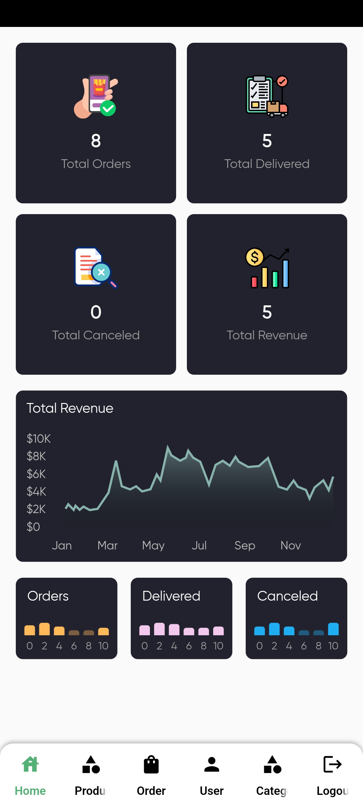

# Ứng dụng di động bán cổ phục Việt Nam

Ứng dụng này nhằm mục đích giới thiệu và bán cổ phục Việt Nam trên thiết bị di động.

## Nhóm phát triển

| Tên                | MSSV     |
| ------------------ | -------- |
| Lê Minh Quang      | 21110279 |
| Ngô Nguyên Bảo     | 21119170 |

## Figma Design

Dưới đây là các màn hình chính của ứng dụng được thiết kế trên Figma:

### Màn hình khởi động và welcome


### Màn hình đăng nhập


### Màn hình chính 



### Màn hình sản phẩm và thêm sản phẩm


### Màn hình đơn đặt hàng


### Màn hình người dùng


### Màn hình danh mục và thêm danh mục


---

## Use Case Diagram


## Description

The Online Fashion Store Admin App is a Flutter-based application designed to provide administrators with tools to manage various aspects of an online fashion store. The app offers features such as:

     - Viewing and managing product listings.
     - Tracking orders and managing order statuses.
     - Managing user accounts and permissions.
     - Generating reports and analytics for business insights.

This app serves as an administrative interface for the backend system of the online fashion store.

## Installation

1. **Clone the repository:**

   ```bash
   git clone https://github.com/Wang24022003/FE_Admin_Mobile.git
   ```

2. **Navigate to the project directory:**

   ```bash
   cd FE_Admin_Mobile
   ```

3. **Install dependencies:**

   ```bash
   flutter pub get
   ```

4. **Run the app:**

   ```bash
   flutter run
   ```

## Usage

Once the app is running, you can:

- Log in using your administrator credentials.
- Navigate through different sections to manage products, orders, users, etc.
- Perform actions such as adding new products, updating order status, and viewing reports.

## Contributing

Contributions are welcome! If you'd like to contribute to this project, please follow these steps:

1. Fork the repository.
2. Create a new branch (`git checkout -b feature/improvement`).
3. Make your changes.
4. Commit your changes (`git commit -am 'Add new feature'`).
5. Push to the branch (`git push origin feature/improvement`).
6. Create a new Pull Request.

## License

This project is licensed under the MIT License - see the [LICENSE](LICENSE) file for details.

## Acknowledgements

- This app was built using [Flutter](https://flutter.dev/).
- Special thanks to [Name of contributors or libraries used].

## Support

For any inquiries or support, please contact [Your Email Address].
